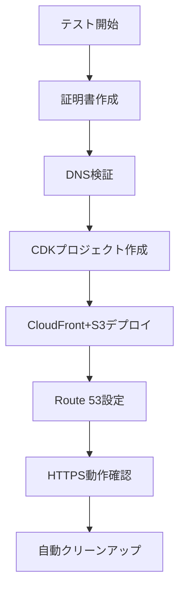

# create-cdn E2Eテスト クイックリファレンス

## 🚀 クイックスタート（既に設定済みの場合）

```bash
# 1. プロジェクトディレクトリに移動
cd /path/to/create-cdn

# 2. E2Eテストを実行
./test-scenarios/run-e2e-test-aws-real.sh

# 3. ログを確認
tail -f test-reports/e2e-aws-real-*.log
```

## 📋 初回セットアップチェックリスト

### ドメイン側（ValueDomain/お名前.com等）
- [ ] サブドメイン用のNSレコードを追加
  ```
  ns aws ns-xxxx.awsdns-xx.org.
  ns aws ns-xxxx.awsdns-xx.co.uk.
  ns aws ns-xxxx.awsdns-xx.com.
  ns aws ns-xxxx.awsdns-xx.net.
  ```

### AWS側
- [ ] Route 53ホストゾーンを作成
- [ ] ホストゾーンIDを取得
- [ ] `.e2e-aws-config.json`を作成

### プロジェクト側
- [ ] 依存関係をインストール（`npm install`）
- [ ] プロジェクトをビルド（`npm run build`）
- [ ] e2e-workspaceディレクトリを作成

## 🔧 設定ファイルテンプレート

### .e2e-aws-config.json
```json
{
  "hostedZoneId": "Z1234567890ABC",
  "baseDomain": "aws.example.com",
  "testEnvironments": {
    "e2e": {
      "domain": "e2e.aws.example.com",
      "subdomains": [
        "test1.e2e.aws.example.com",
        "test2.e2e.aws.example.com"
      ]
    }
  }
}
```

## 📊 テスト実行フロー



## 🛠️ よく使うコマンド

### DNS確認
```bash
# NS委任の確認
dig ns aws.example.com +short

# 特定レコードの確認
dig a test.e2e.aws.example.com
```

### AWS リソース確認
```bash
# ホストゾーン一覧
aws route53 list-hosted-zones

# CloudFormationスタック一覧
aws cloudformation list-stacks --stack-status-filter CREATE_COMPLETE

# CloudFront一覧
aws cloudfront list-distributions
```

### クリーンアップ
```bash
# CDKスタック削除
cd e2e-workspace/test-project-*
npx cdk destroy --force

# 証明書削除
aws acm delete-certificate --certificate-arn arn:aws:acm:... --region us-east-1
```

## ⚠️ トラブルシューティング

### 問題: DNS委任が機能しない
```bash
# 親ドメインのNSサーバーに直接問い合わせ
dig @ns1.value-domain.com ns aws.example.com
```

### 問題: 証明書検証が進まない
```bash
# ACM証明書の状態確認
aws acm describe-certificate --certificate-arn $CERT_ARN --region us-east-1
```

### 問題: テストが途中で止まった
```bash
# 手動でリソースを確認・削除
aws cloudformation describe-stacks --query "Stacks[?contains(StackName, 'E2ETest')]"
```

## 📝 テスト実行例

### 基本実行
```bash
./test-scenarios/run-e2e-test-aws-real.sh
```

### デバッグモード（リソースを残す）
```bash
./test-scenarios/run-e2e-test-aws-real.sh --keep
```

### カスタムドメイン指定
```bash
./test-scenarios/run-e2e-test-aws-real.sh --domain special-test.e2e.aws.example.com
```

## 🎯 成功時の出力例

```
🚀 create-cdn E2E Test (Real AWS)
=====================================
Test ID: 20250122-123456
Test Domain: test-20250122-123456.e2e.aws.example.com

✅ Certificate validated and issued!
✅ CDN deployed successfully!
✅ HTTPS access successful (Status: 200)
✅ SSL certificate verified
✅ E2E test completed successfully!
```

## 📈 パフォーマンス目安

- DNS委任反映: 5分〜48時間
- 証明書発行: 1〜5分
- CloudFrontデプロイ: 5〜10分
- 全体のテスト時間: 15〜20分

## 🔗 関連ドキュメント

- [完全ガイド](./E2E_TEST_GUIDE.md)
- [create-cdn README](../README.md)
- [AWS公式ドキュメント](https://docs.aws.amazon.com/)