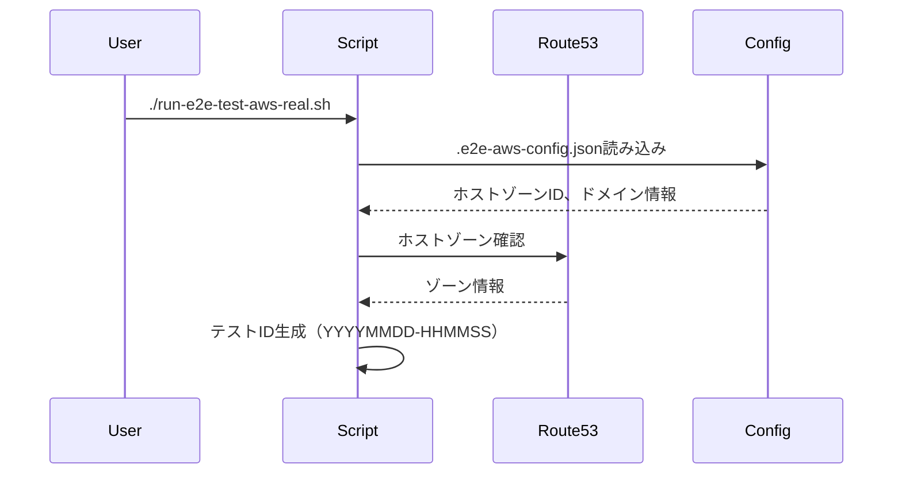
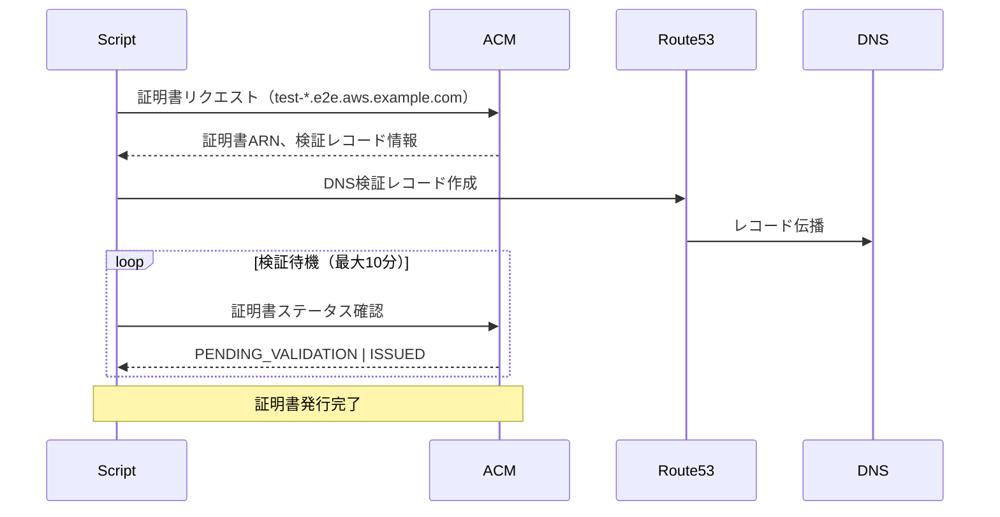
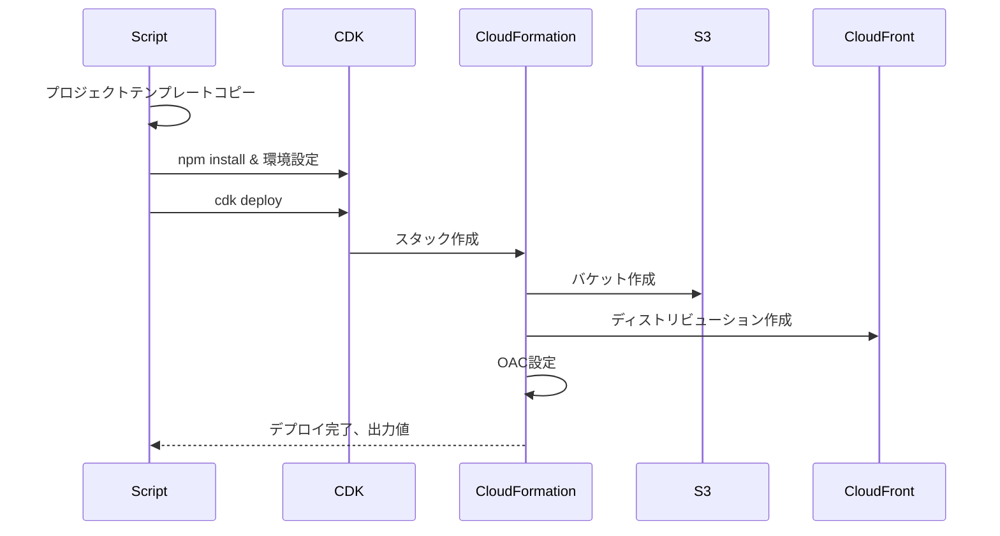
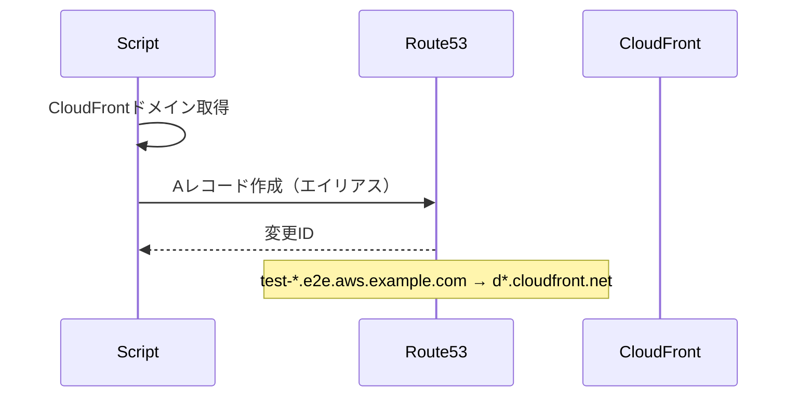
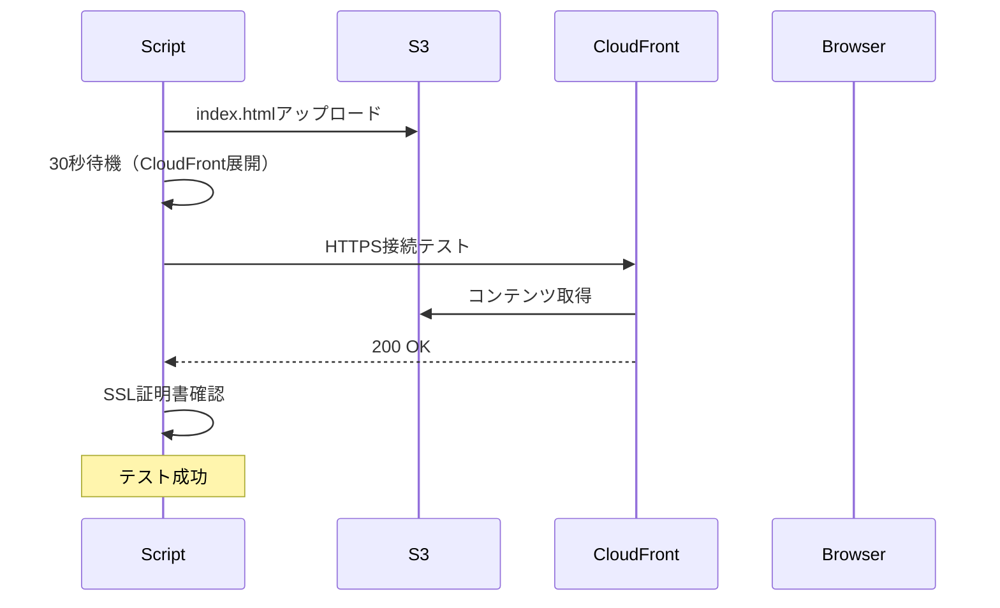
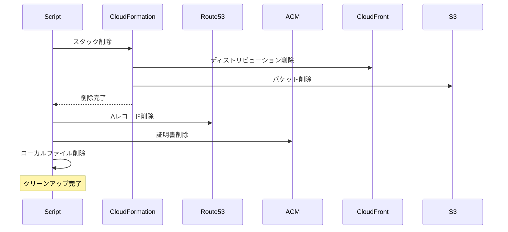

# create-cdn E2Eテストアーキテクチャ

## システム構成図

```
┌─────────────────────────────────────────────────────────────┐
│                     Domain Registrar                         │
│                  (ValueDomain/お名前.com等)                   │
│                                                             │
│  example.com                                                │
│  └── NS aws → Route 53 Name Servers                        │
└─────────────────────────────────────────────────────────────┘
                                │
                                │ DNS委任
                                ▼
┌─────────────────────────────────────────────────────────────┐
│                        AWS Route 53                          │
│                                                             │
│  Hosted Zone: aws.example.com                               │
│  ├── e2e.aws.example.com                                   │
│  │   └── test-YYYYMMDD-HHMMSS.e2e.aws.example.com         │
│  ├── dev.aws.example.com                                   │
│  └── demo.aws.example.com                                  │
└─────────────────────────────────────────────────────────────┘
                                │
                    ┌───────────┴───────────┐
                    ▼                       ▼
┌─────────────────────────────┐ ┌─────────────────────────────┐
│      AWS Certificate        │ │      AWS CloudFront         │
│        Manager (ACM)        │ │                             │
│                             │ │  Distribution:              │
│  Region: us-east-1          │ │  - Custom Domain            │
│  - SSL/TLS証明書            │ │  - Origin: S3               │
│  - DNS検証                  │ │  - SSL証明書適用            │
└─────────────────────────────┘ └─────────────────────────────┘
                                            │
                                            ▼
                                ┌─────────────────────────────┐
                                │         AWS S3              │
                                │                             │
                                │  Bucket:                    │
                                │  - Static Website Content   │
                                │  - OAC (Origin Access)      │
                                └─────────────────────────────┘
```

## E2Eテストフロー詳細

### 1. 環境準備フェーズ



### 2. 証明書作成フェーズ



### 3. CDKデプロイフェーズ



### 4. DNS設定フェーズ



### 5. 動作確認フェーズ



### 6. クリーンアップフェーズ



## ディレクトリ構造

```
create-cdn/
├── .e2e-aws-config.json        # E2E設定ファイル
├── e2e-workspace/              # テスト作業ディレクトリ（.gitignore）
│   ├── test-project-*/         # 一時的なCDKプロジェクト
│   └── test-index.html         # テスト用HTMLファイル
├── test-scenarios/             # テストスクリプト
│   ├── run-e2e-test-aws-real.sh
│   ├── setup-aws-subdomain-e2e.sh
│   └── test-config/
│       └── mock-dns-config.json
├── test-reports/               # テストレポート
│   └── e2e-aws-real-*.log
└── template/                   # CDKプロジェクトテンプレート
    ├── bin/
    ├── lib/
    ├── cdk.json
    └── package.json
```

## 設定ファイル詳細

### .e2e-aws-config.json

```json
{
  "hostedZoneId": "Z1234567890ABC",     // Route 53ホストゾーンID
  "baseDomain": "aws.example.com",      // 委任されたベースドメイン
  "testEnvironments": {
    "e2e": {
      "domain": "e2e.aws.example.com",  // E2Eテスト用サブドメイン
      "subdomains": [                   // 追加のテストドメイン
        "test1.e2e.aws.example.com",
        "test2.e2e.aws.example.com"
      ]
    }
  }
}
```

### 環境変数（.env）

```bash
DOMAIN_NAME=test-20250122-123456.e2e.aws.example.com
CERTIFICATE_ARN=arn:aws:acm:us-east-1:123456789012:certificate/xxx
USE_CLOUDFRONT=true
CDK_DEFAULT_REGION=us-east-1
```

## セキュリティ考慮事項

1. **IAM権限**
   - Route 53: ホストゾーンとレコードの管理
   - ACM: 証明書の作成と削除
   - CloudFormation: スタックの作成と削除
   - S3: バケットの作成と削除
   - CloudFront: ディストリビューションの管理

2. **リソースタグ**
   ```
   Environment: e2e-test
   TestID: YYYYMMDD-HHMMSS
   ManagedBy: create-cdn-e2e
   ```

3. **自動削除設定**
   - S3バケット: RemovalPolicy.DESTROY
   - 自動オブジェクト削除: 有効
   - スタック削除時の完全クリーンアップ

## パフォーマンス最適化

1. **並列処理**
   - DNS検証レコードの一括作成
   - 複数リソースの並行削除

2. **タイムアウト設定**
   - 証明書検証: 最大10分
   - CloudFormationデプロイ: 最大15分
   - 全体のテスト: 最大30分

3. **キャッシュ活用**
   - npm依存関係のキャッシュ
   - CDKアセットのキャッシュ

## 監視とログ

1. **ログ出力**
   - リアルタイムコンソール出力
   - タイムスタンプ付きログファイル
   - 構造化されたJSONサマリー

2. **エラーハンドリング**
   - 各フェーズでのエラーキャッチ
   - 自動リトライ（DNS検証）
   - 失敗時の部分的クリーンアップ

3. **メトリクス**
   - 各フェーズの実行時間
   - 成功/失敗率
   - リソース作成数